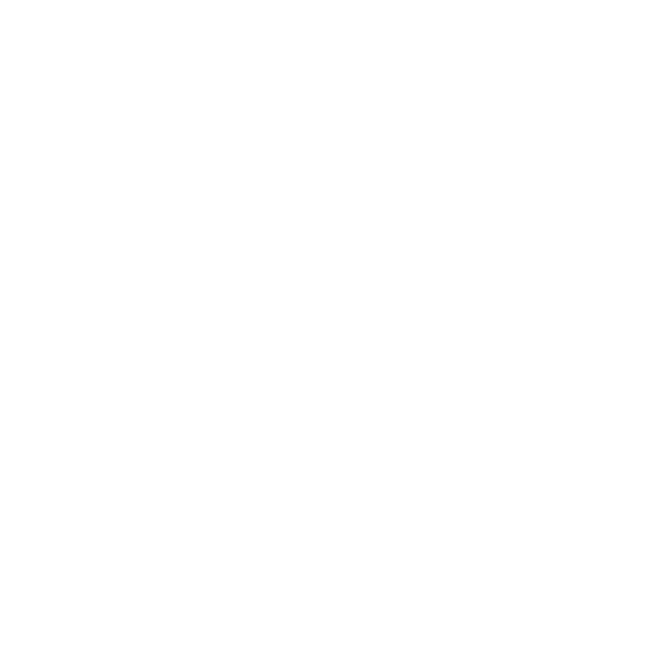
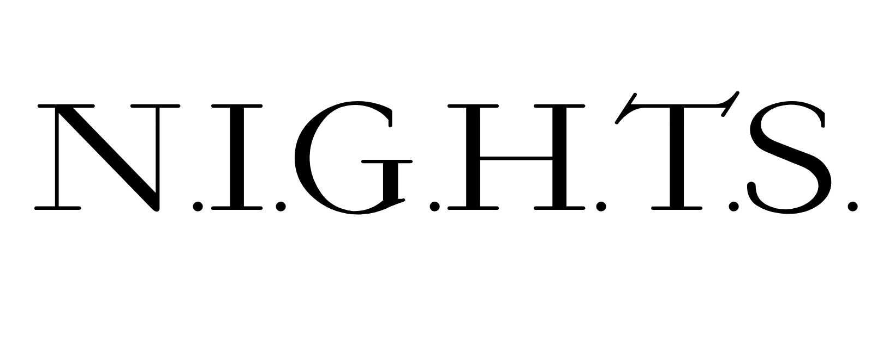

#  N.I.G.H.T.S
A framework designed to give developers a solid foundation for creating **Five Nights at Freddy’s fangames** — modular, flexible, and built with accessibility in mind.

---

## 🚀 Overview
**N.I.G.H.T.S** is a project aimed at making FNaF fangame development simpler, faster, and more approachable.  
No need to reinvent the camera system, A.I., or power mechanics — just build, tweak, and experiment.

---

## 🧩 Core Features
- **Base FNaF Engine:** A stable, extendable gameplay framework.  
- **Custom Sprites:** Drop in your own character sprites, rooms, and UI elements.  
- **AI Customization:** Set aggression, attack patterns, and personality per character.  
- **Cross-Platform Exports:** Build for Windows, macOS, Linux, and more.  
- **Clickteam Fusion 2.5 Support:** Optional export for Fusion users.

---

📋 TD;LR – To-Do List

- [ ] Create base FNaF engine  
- [ ] Add custom sprite support  
- [ ] Implement AI behavior editor  
- [ ] Enable Clickteam Fusion 2.5 export  
- [ ] Add export support for major platforms  
- [ ] Write setup and usage documentation  
- [ ] Release example project  

---

## 🛠️ Getting Started
**(Coming Soon)**  
Setup guides and documentation will be added once the engine’s core systems are complete.  
For now, development progress can be tracked through the **Issues** and **Projects** tabs.

---

## 🤝 Contributing
Contributions are welcome — whether it’s bug fixes, feature ideas, or documentation improvements.  
Before opening a pull request, please check for existing issues and follow the contribution guidelines (coming soon).

---

## 🧾 Credits
- **FNaF Franchise:** Scott Cawthon  
- **Engine Development:** @rilwag2612  
- **Contributors:** (to be added)

---

## ⚖️ Legal Notice
Five Nights at Freddy’s is a copyrighted property of **Scott Cawthon**.  
Fan-made projects are allowed under the condition that they remain **free** and **non-commercial**.

**N.I.G.H.T.S** and its contributors are **not responsible** for any legal consequences resulting from misuse of this toolkit, including but not limited to:
- Charging users to access or play a fangame.  
- Distributing illegal or explicit content (e.g. CSAM, malware, etc.).  
- Claiming official affiliation with the FNaF franchise.

Scott Cawthon once commented on a [Steam Discussion](https://steamcommunity.com/app/388090/discussions/0/364039785165876479/):

> "I'm not worried about the ad revenue from Gamejolt."

It’s unknown whether this statement applies strictly to GameJolt or to other forms of ad revenue,  
but many in the community infer that non-intrusive monetization (like ads or donations) isn’t a major concern.  
*(This interpretation may be outdated or incorrect — please do your own research before monetizing any fangame.)*

Use responsibly. Credit fairly. Keep it free.

